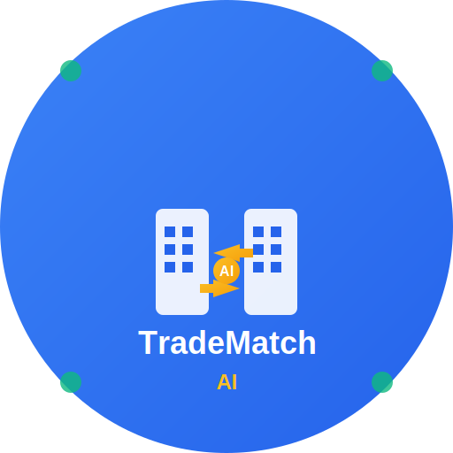

# TradeMatch AI - Global Trade Matching Platform



AI-powered global trade matching platform that connects buyers and sellers worldwide with intelligent matching, automated consultations, and comprehensive trade process management.

## 🌟 Features

### 🔐 Authentication System
- **Role-based Login**: Separate portals for buyers and sellers
- **Test Accounts**: 
  - Buyer: `buyer` / `test123`
  - Seller: `seller` / `test123`

### 📊 Dashboard
- **Personalized Metrics**: Role-specific KPIs and statistics
- **Quick Actions**: Context-aware shortcuts for common tasks
- **Real-time Notifications**: Live updates on matches and activities

### 🤖 AI Phone Consultation
- **Global AI Agents**: 3 regional specialists (Asia, Americas, Europe)
- **Multi-language Support**: Native language consultations
- **Call Management**: Schedule, track, and analyze consultation results
- **Pricing Plans**: Basic ($29), Premium ($59), Enterprise ($149)

### 🔄 Trade Process Management
- **Step-by-step Tracking**: 8-stage import/export process monitoring
- **Progress Visualization**: Real-time progress bars and status updates
- **Role-specific Workflows**: Customized processes for buyers vs sellers

### 📄 Document Management
- **Trade Documents**: Complete library of import/export documents
- **Document Templates**: Ready-to-use forms and contracts
- **Trade Dictionary**: Comprehensive glossary of trade terms (Incoterms, Payment terms, etc.)

### 📈 Market Analysis
- **Real-time Trends**: Live market data and growth indicators
- **Partner Recommendations**: AI-driven matching suggestions
- **Geographic Insights**: Country-specific trade opportunities

### 👤 Profile Management
- **Company Information**: Comprehensive business profiles
- **Credit Scoring**: Dynamic credit evaluation system
- **Certification Tracking**: Business verification status

## 🚀 Tech Stack

- **Frontend**: React 18 + TypeScript
- **Styling**: Custom CSS utility classes (Tailwind-inspired)
- **Icons**: Lucide React
- **State Management**: React Hooks
- **Deployment**: Vercel
- **Version Control**: GitHub

## 📱 Responsive Design

- **Mobile-first**: Optimized for all screen sizes
- **Cross-platform**: Works seamlessly on desktop, tablet, and mobile
- **Modern UI**: Clean, professional interface with intuitive navigation

## 🛠️ Development

### Prerequisites
- Node.js 16+
- npm or yarn

### Installation

```bash
# Clone the repository
git clone https://github.com/axconkr/TradeMatch-AI.git
cd TradeMatch-AI

# Install dependencies
npm install

# Start development server
npm start
```

### Available Scripts

- `npm start` - Run development server
- `npm run build` - Create production build
- `npm test` - Run test suite
- `npm run eject` - Eject from Create React App

## 🌐 Live Demo

Visit the live application: [TradeMatch AI](https://tradematch-iwlt0lxf7-catherinehlabs-projects.vercel.app)

## 📋 Test Scenarios

### Buyer Journey
1. Login with `buyer` / `test123`
2. View personalized dashboard with supplier recommendations
3. Request AI consultation for supplier evaluation
4. Track import process progress
5. Manage trade documents and contracts

### Seller Journey
1. Login with `seller` / `test123`
2. Explore market opportunities and buyer leads
3. Schedule AI consultations with potential clients
4. Monitor export process stages
5. Update company profile and certifications

## 🔮 Future Enhancements

- **Backend API**: RESTful API with PostgreSQL database
- **Real-time Chat**: Direct messaging between buyers and sellers
- **Payment Integration**: Secure payment processing
- **Mobile App**: Native iOS and Android applications
- **Advanced Analytics**: Machine learning-powered insights
- **Multi-language Support**: Full internationalization

## 📞 Support

For support and inquiries, please create an issue in the GitHub repository.

## 📄 License

© 2025 Phillip.Hong. All rights reserved.

---

**Built with ❤️ using Claude Code**
